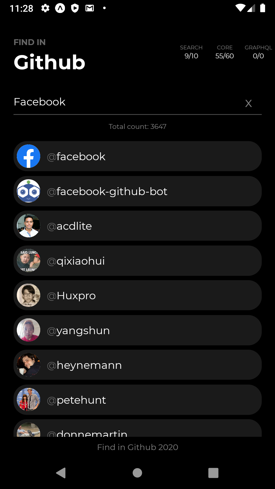
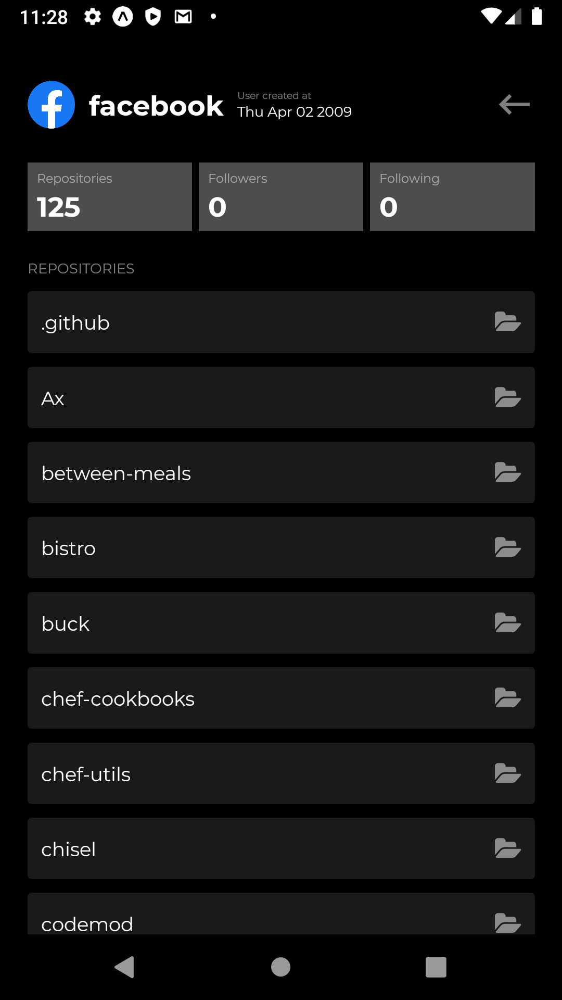
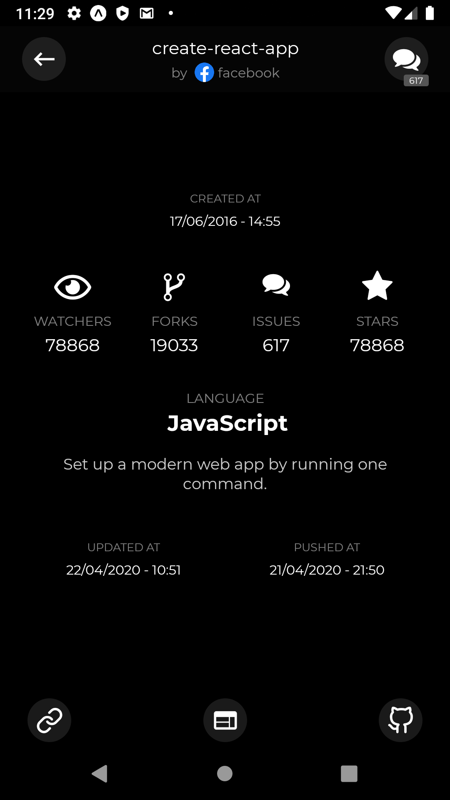
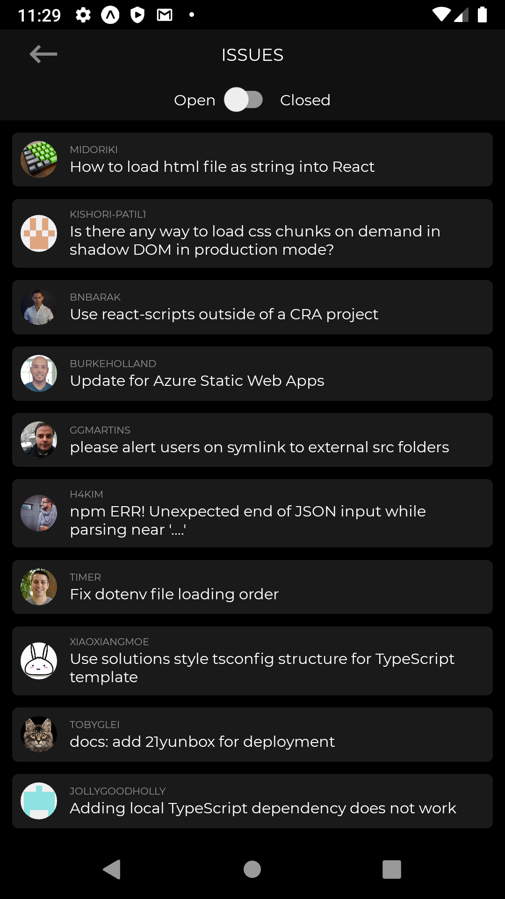

<h1 align="center">Find in Github</h1>

  Um App de pesquisas utilizado a API do Github

## Principais tecnologias
* Expo
* React Native
* React Navigation

## Objetivo
Um app para testar e aprimorar meus conhecimentos em React Native. Fazndo o uso de libs que, anteriormente, tive pouca ou nenhum contato.

## Screenshots

